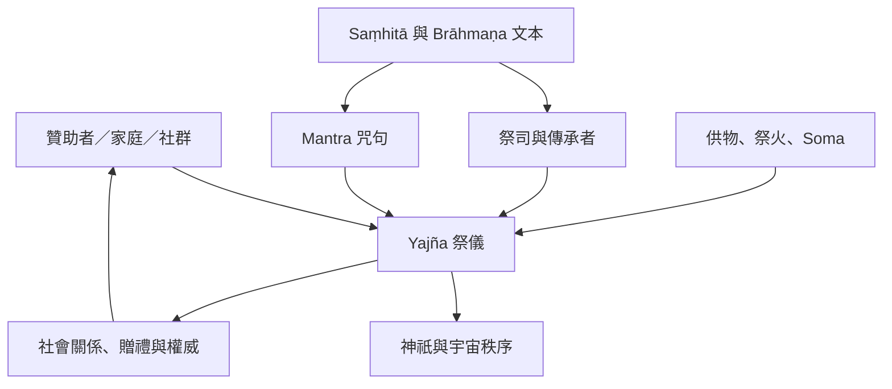

祭儀是早期吠陀宗教與社會秩序的重要交會點。此圖呈現咒句、供物、祭司、贊助者與神祇之間的關係；實際儀式會因文本、時代與地區而不同。

```mermaid
flowchart TD
    PAT[贊助者／家庭／社群] --> RIT[Yajña 祭儀]
    PR[祭司與傳承者] --> RIT
    TXT[Mantra 咒句] --> RIT
    OFF[供物、祭火、Soma] --> RIT
    RIT --> GOD[神祇與宇宙秩序]
    RIT --> SOC[社會關係、贈禮與權威]
    SOC --> PAT
    TEXT[Saṃhitā 與 Brāhmaṇa 文本] --> PR
    TEXT --> TXT
```

**互鏈概念**：[[祭儀是人與神祇及社群之間的交換秩序]]、[[梨俱吠陀宗教應放回社會組織與祭儀結構理解]]、[[Soma]]、[[Yajña]]、[[Mantra]]、[[Vedas]]。
