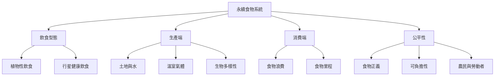

永續飲食要同時考慮食物生產、消費、浪費、土地與水資源、氣候、可負擔性和地方生計。植物性食物通常能降低部分環境負荷，但不能用單一「植物」標籤抹去生產方式差異與全球食物不平等。

```mermaid
graph TD
 A[永續食物系統] --> B[飲食型態]
 B --> C[植物性飲食]
 B --> D[行星健康飲食]
 A --> E[生產端]
 E --> F[土地與水]
 E --> G[溫室氣體]
 E --> H[生物多樣性]
 A --> I[消費端]
 I --> J[食物浪費]
 I --> K[食物里程]
 A --> L[公平性]
 L --> M[食物正義]
 L --> N[可負擔性]
 L --> O[農民與勞動者]
```

延伸閱讀：[[植物性飲食的環境優勢必須放進生命週期與地方脈絡]]、[[行星健康飲食把個人餐盤連結到全球食物系統]]、[[食物里程]]、[[食物正義]]。
