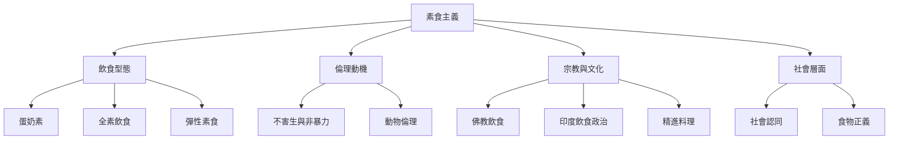

素食主義是一個由飲食型態、倫理動機、宗教規範、身份認同與公共制度交織而成的知識領域。閱讀時先界定飲食分類，再理解不害生與動物倫理，最後放回地方文化和食物政治。

```mermaid
graph TD
 A[素食主義] --> B[飲食型態]
 B --> C[蛋奶素]
 B --> D[全素飲食]
 B --> E[彈性素食]
 A --> F[倫理動機]
 F --> G[不害生與非暴力]
 F --> H[動物倫理]
 A --> I[宗教與文化]
 I --> J[佛教飲食]
 I --> K[印度飲食政治]
 I --> L[精進料理]
 A --> M[社會層面]
 M --> N[社會認同]
 M --> O[食物正義]
```

延伸閱讀：[[素食主義]]、[[全素飲食]]、[[蛋奶素]]、[[彈性素食]]、[[不害生與非暴力]]、[[動物倫理]]、[[食物正義]]、[[社會認同]]。
