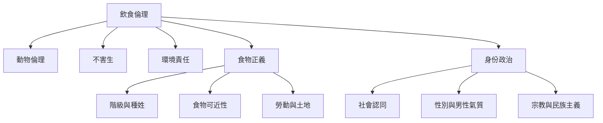

素食倫理並不只是一道個人餐桌上的選擇題。動物痛苦、宗教潔淨觀、種姓與階級、性別身份、社群規範、勞動權與食物可近性都可能參與飲食制度的形成。概念地圖用來提醒閱讀者：非暴力理想必須接受權力效果的檢驗。

```mermaid
graph TD
 A[飲食倫理] --> B[動物倫理]
 A --> C[不害生]
 A --> D[環境責任]
 A --> E[食物正義]
 E --> F[階級與種姓]
 E --> G[食物可近性]
 E --> H[勞動與土地]
 A --> I[身份政治]
 I --> J[社會認同]
 I --> K[性別與男性氣質]
 I --> L[宗教與民族主義]
```

延伸閱讀：[[飲食倫理需要同時考慮動物個體與食物生產制度]]、[[不殺生的倫理理想不會自動消除社會中的暴力]]、[[食物正義]]、[[社會認同]]。
