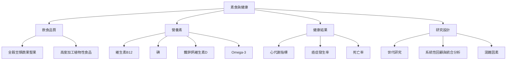

健康問題需要拆分成飲食品質、營養素供應、疾病結果與研究設計。素食的健康關聯不能只用飲食標籤解釋，需檢查強化食品、補充策略、食品加工程度、生活型態混雜及特定生命階段。

```mermaid
graph TD
 A[素食與健康] --> B[飲食品質]
 B --> C[全穀豆類蔬果堅果]
 B --> D[高度加工植物性食品]
 A --> E[營養素]
 E --> F[維生素B12]
 E --> G[碘]
 E --> H[鐵鋅鈣維生素D]
 E --> I[Omega-3]
 A --> J[健康結果]
 J --> K[心代謝指標]
 J --> L[癌症發生率]
 J --> M[死亡率]
 A --> N[研究設計]
 N --> O[世代研究]
 N --> P[系統性回顧與統合分析]
 N --> Q[混雜因素]
```

延伸閱讀：[[營養充足性取決於整體食物組合與可靠補足]]、[[健康研究中的素食效果不能脫離混雜因素與飲食品質]]、[[維生素B12]]、[[營養生物利用率]]。
