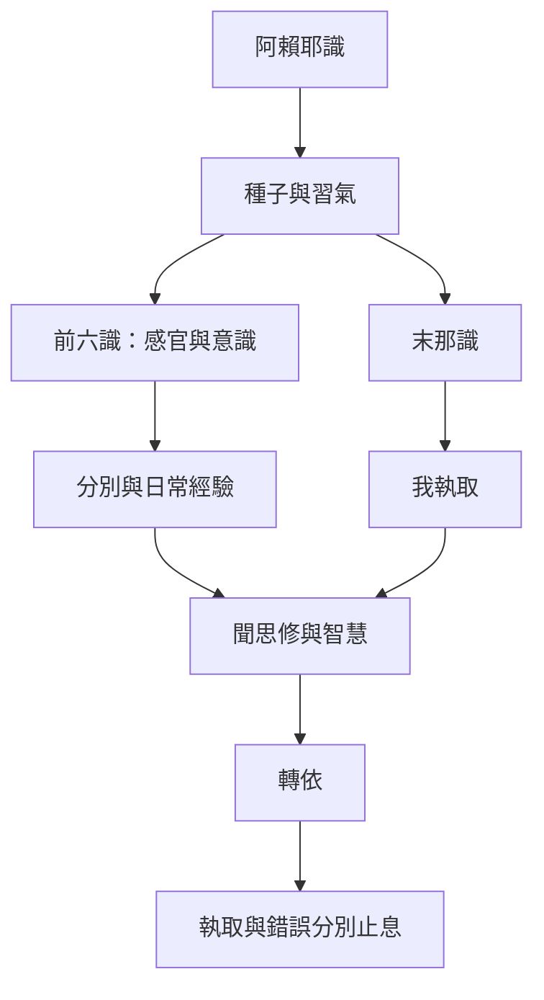

八識模型將明顯的感官與意識活動、持續的自我執取，以及潛在的種子與習氣放在同一個分析架構中。轉依指向修道上的根本轉化，不是把第八識當作更真實的自我。

```mermaid
graph TD
  A[前六識：感官與意識] --> B[分別與日常經驗]
  C[末那識] --> D[我執取]
  E[阿賴耶識] --> F[種子與習氣]
  F --> A
  F --> C
  B --> G[聞思修與智慧]
  D --> G
  G --> H[轉依]
  H --> I[執取與錯誤分別止息]
```

與[[瑜伽行派八識與轉依概念地圖]]、[[佛教六識到八識的思想演變概念地圖]]及[[空性提醒我們不可把意識提升為新的永恆實體]]相互參照。
