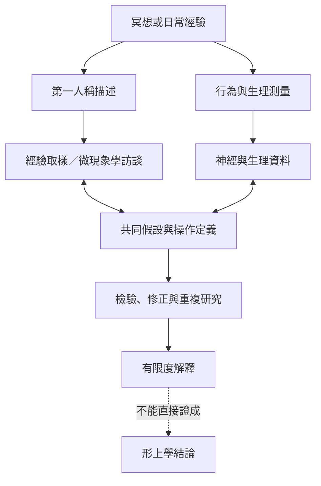

當代心識研究可以同時採用第一人稱描述、行為觀察與生理測量，但三者需要在明確的研究設計中互相校正。經驗敘述不能單獨證明形上學，腦訊號也不能被直接等同於主觀經驗。

```mermaid
graph TD
  A[冥想或日常經驗] --> B[第一人稱描述]
  A --> C[行為與生理測量]
  B --> D[經驗取樣／微現象學訪談]
  C --> E[神經與生理資料]
  D <--> F[共同假設與操作定義]
  E <--> F
  F --> G[檢驗、修正與重複研究]
  G --> H[有限度解釋]
  H -.不能直接證成.-> I[形上學結論]
```

與[[當代第一人稱研究與科學方法概念地圖]]、[[神經現象學讓第一人稱經驗與第三人稱測量互相校正]]及[[第一人稱經驗能參與科學研究但不能單獨證成形上學]]相互參照。
