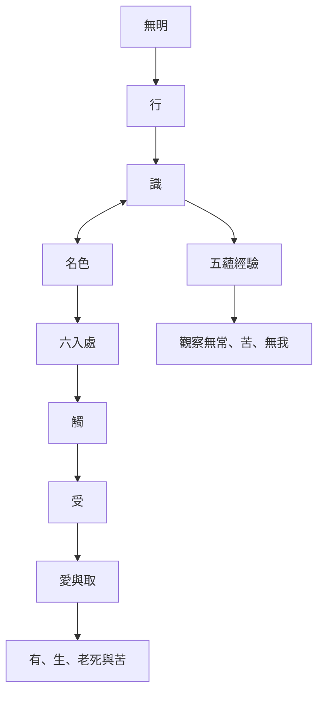

此圖呈現識在緣起網絡中的條件性。行與識、識與名色、名色與六入處等關係，說明經驗不由一個常住主體單方面支配。名色與識的互依尤其提醒我們，經驗連續性可由條件關係說明。

```mermaid
graph TD
  A[無明] --> B[行]
  B --> C[識]
  C <--> D[名色]
  D --> E[六入處]
  E --> F[觸]
  F --> G[受]
  G --> H[愛與取]
  H --> I[有、生、老死與苦]
  C --> J[五蘊經驗]
  J --> K[觀察無常、苦、無我]
```

與[[緣起與無我概念地圖]]、[[佛教六識到八識的思想演變概念地圖]]及[[無我不否定經驗連續而是否定固定主體]]相互參照。
