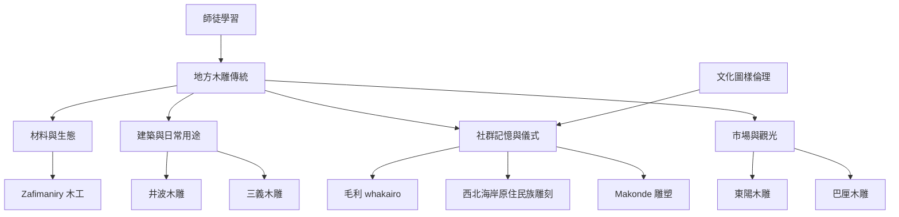

全球木雕不是單一風格的擴散史，而是多種地方材料、社會制度、建築用途與文化記憶的交織。比較案例時，應先辨認作品的社群與用途，再討論形式相似或差異。

```mermaid
flowchart TD
  A[地方木雕傳統] --> B[材料與生態]
  A --> C[建築與日常用途]
  A --> D[社群記憶與儀式]
  A --> E[市場與觀光]
  B --> F[Zafimaniry 木工]
  C --> G[井波木雕]
  C --> H[三義木雕]
  D --> I[毛利 whakairo]
  D --> J[西北海岸原住民族雕刻]
  D --> K[Makonde 雕塑]
  E --> L[東陽木雕]
  E --> M[巴厘木雕]
  N[師徒學習] --> A
  O[文化圖樣倫理] --> D
```

概念延伸：[[工藝保存必須同時保存技術符號與使用場域]]、[[文化圖樣的借用需要脈絡與權利意識]]、[[地方木雕產業會隨材料與市場共同轉型]]。

---

[[Wood_carving]]
