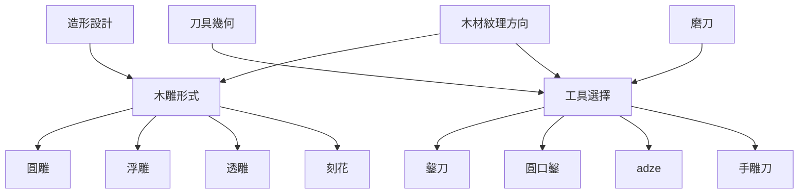

不同雕刻形式代表對體積、背景與空間採取不同策略；工具則以刃口幾何和切削方式回應材料。這張地圖適合在選擇第一件作品或比較不同地區工藝時使用。

```mermaid
flowchart TD
  A[造形設計] --> B[木雕形式]
  B --> C[圓雕]
  B --> D[浮雕]
  B --> E[透雕]
  B --> F[刻花]
  G[刀具幾何] --> H[工具選擇]
  H --> I[鑿刀]
  H --> J[圓口鑿]
  H --> K[adze]
  H --> L[手雕刀]
  M[磨刀] --> H
  N[木材紋理方向] --> B
  N --> H
```

概念延伸：[[木雕形式的差異來自形體與背景如何互相處理]]、[[刀具幾何會改變切削行為]]、[[雕刻設計需要在下刀前理解形體]]。

---

[[Wood_carving]]
