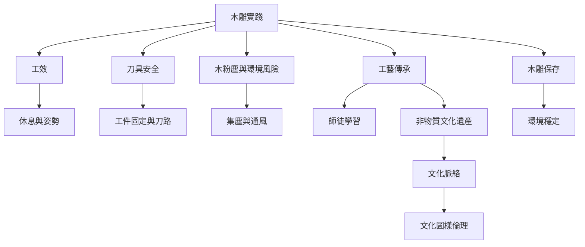

木雕是一種長時間身體勞動，安全、工效、保存和傳承彼此相連。工藝不只需要作品被留下，也需要工作者有可持續的工作條件，以及社群能繼續掌握技術和文化意義。

```mermaid
flowchart TD
  A[木雕實踐] --> B[刀具安全]
  A --> C[工效]
  A --> D[木粉塵與環境風險]
  C --> E[休息與姿勢]
  B --> F[工件固定與刀路]
  D --> G[集塵與通風]
  A --> H[工藝傳承]
  H --> I[師徒學習]
  H --> J[非物質文化遺產]
  J --> K[文化脈絡]
  A --> L[木雕保存]
  L --> M[環境穩定]
  K --> N[文化圖樣倫理]
```

概念延伸：[[重複雕刻需要以工效與休息管理身體負荷]]、[[工藝保存必須同時保存技術符號與使用場域]]、[[建立一張工作室安全檢查表並讓參與者共同維護]]。

---

[[Wood_carving]]
